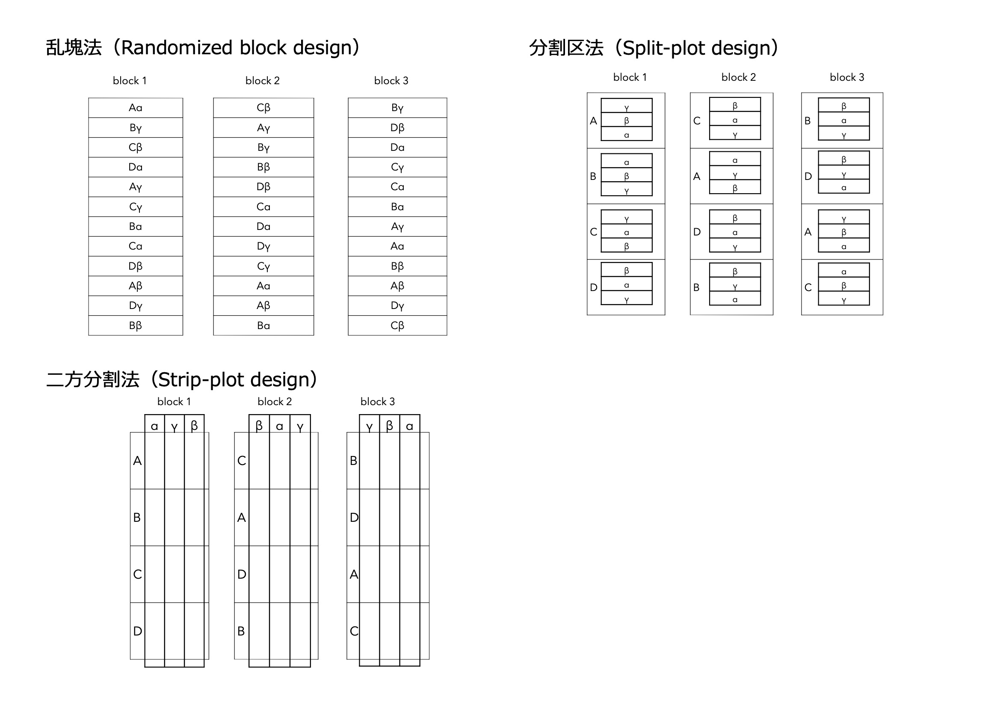

R on Online for Ibadai 20230217 by Ryosuke TAJIMA 
==============  
  
# 時間短縮のために
あらかじめライブラリを入れておいてください．
Rの画面上に以下のコードをコピペすればOK．
```R  
install.packages("multcomp", dependency=T) #多重比較用ライブラリ
install.packages("corrplot", dependency=T) #良い感じの相関図ライブラリ
install.packages("dplyr", dependency=T) #データハンドリング用最強ライブラリ
install.packages("ggplot2", dependency=T) #良い感じの図作成ライブラリ
```

# 基本
## R言語の基本的な操作
```R  
x<-2
y<-5
a<-c(1,3,5,7,9) #数字列
b<-c(2,4,6,8,10) #数字列
b<-c(3,6,9,12,15) #後から入れたものに更新される
e<-a+b #要素の足し算
f<-a*b #要素の掛け算
moji<-c("A","B","C","D") #文字列も要素になる
```

## データの読み込み
GUIでFile > Change Directory ...  
または，

```R  
getwd()
setwd()

d<-read.table("data.txt", header=T)
# 読み込んだデータのチェック
d
head(d)
```  
  
## データセットの一部を抽出  
```R  
X<-d[2,3]
X<-d[1:3,4:7]  
X<-d[3,]  
X<-d[,8]  
```  
  
## headerを使った抽出  
```R  
Tr<-d$Tr  
Tr<-d$tr #null, 大文字と小文字は区別される
```
  
## クラスの確認
```R  
class(d$Tr)  
class(d$ShootDW)  
```  
numeric -> 数値，character -> 文字列，factor -> ファクターなど

## subsetを使った抽出
```R  
dA<-subset(d,d$G=="A")  
dSSL<-subset(d,d$Tr=="SSL")  
```  

## データの追加
```R  
# 換算値を足す
ShootN<-d$ShootDW*d$NC/100*1000
d2<-cbind(d,ShootN)
```  

## データのアウトラインを相関図で確認する  
```R  
plot(d2[,6:13])  
plot(d2[,6], d2[,7])
plot(d2$ShootDW, d2$RootDW)
```  

## データのアウトラインを箱ひげ図で確認する  
```R  
boxplot(d$ShootDW)  
boxplot(d$ShootDW~d$G)  
boxplot(d5$ShootDW~d$Tr)  
```  

# 統計解析  
## 一元配置の分散分析  
```R  
result<-aov(ShootDW~G, d)  
summary(result)  
```  

## 一元配置の分散分析：乱塊法
```R  
result<-aov(ShootDW~Rep+G, d)  
summary(result)  
```  

## 二元配置の分散分析  
```R  
result<-aov(ShootDW~G+Tr+G*Tr, d)  
summary(result)  
result<-aov(ShootDW~G*Tr, d)  
summary(result)  
```  

## 二元配置の分散分析：乱塊法
```R  
result<-aov(ShootDW~Rep+G*Tr, d)  
summary(result)  
```  

## 二元配置の分散分析：分割区法
```R  
result<-aov(ShootDW~Rep+Tr+Error(Rep/Tr)+G+G*Tr, d)  
summary(result)  
```  
  
## 二元配置の分散分析：二方分割法
```R  
result<-aov(ShootDW~Rep+Tr+G+Error(Rep/(Tr*G))+G*Tr, d)  
summary(result)  
```  

## 参考図


## TukeyHSDによる多重比較  
```R  
Lavels<-c("A_SSL", "A_SSL", "A_SSL", "A_SSL", "A_SSNL", "A_SSNL", "A_SSNL", "A_SSNL", "B_SSL", "B_SSL", "B_SSL", "B_SSL", "B_SSNL", "B_SSNL", "B_SSNL", "B_SSNL")
d3<-cbind(Lavels, d2)
result<-aov(ShootDW~Lavels, d3) # 一元配置の分散分析
summary(result)  
TukeyHSD(result)  
```  
  
## 多重比較にライブラリmultcomp利用
```R  
install.packages("multcomp", dependency=T)
library(multcomp)
d3$Lavels<-as.factor(d3$Lavels) #クラスをfactorにする
result<-aov(ShootDW~Lavels, d3) #一元配置の分散分析
Tukey<-glht(result, linfct=mcp(Lavels="Tukey"))  
summary(Tukey)  
cld(Tukey, level = 0.05, decreasing = TRUE) # アルファベットをつける

# Dunnettもできる
Dunnett<-glht(result, linfct=mcp(Lavels="Dunnett"))  
summary(Dunnett)  
```  
  
## 相関  
```R  
cor(d$ShootDW, d$RLDtop)  
allcor<-cor(d2[,4:13]) #まとめて解析  
allcor
```  
  
## 回帰分析
```R  
result<-lm(ShootDW~RLDtop, d)  
summary(result)  
```  
  
## 重回帰分析
```R  
allcor # 事前に多重共線性のチェック
result<-lm(ShootDW~NC+RootLength, d2)  
summary(result)  
```  

## 主成分分析
本来は多重共線性を確認した方が良い
```R  
d4<-read.csv("data.csv")
sd4<-d4[,2:12]  
Pr1<-prcomp (sd4)  
summary(Pr1)  
biplot(Pr1)
ssd4<-scale(sd4) #正規化  
Pr2<-prcomp (ssd4)
summary(Pr2)  
biplot(Pr2)
Pr2$rotation  
```  

# 便利なライブラリ
## corrplot
```R  
install.packages("corrplot", dependency=T)
library(corrplot)
cor<-cor(d2[,4:13])
corrplot(cor,method="ellipse", type="upper") #methodはnumber, squareなど，typeはlowerも
corrplot.mixed(cor,lower="number",upper='ellipse') # 混ぜられる
```  

## dplyr
```R  
install.packages("dplyr", dependency=T)
library(dplyr)
ds <-d %>%
    mutate(ShootN=d$ShootDW*d$NC/100*1000) %>%
    filter(d$G == "A") %>%
    group_by(Tr) %>%
    summarise_if(is.numeric, mean)
ds<-data.frame(ds)
```  

## ggplot2
```R  
install.packages("ggplot2", dependency=T)
library(ggplot2)
# 散布図  
plot<-ggplot(data=d, mapping=aes(x=ShootDW, y=RootDW))+
    geom_point(aes(color=G, shape =Tr))+
    geom_smooth(method = "lm")
plot
```  

以上